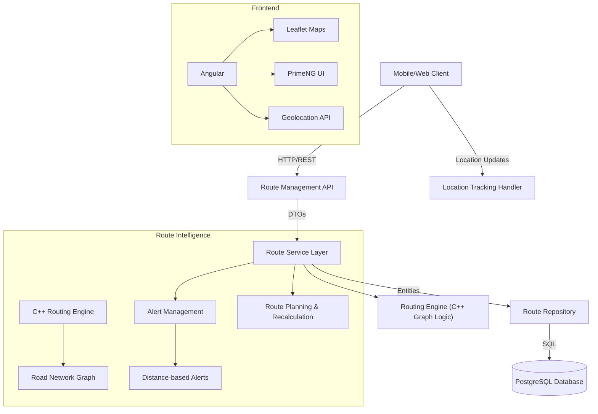

# 🧭 RouteOps — Smart Personal Route Guidance System


## 📖 Abstract

**RouteOps** is an intelligent personal navigation companion that guides users along optimal routes with live tracking, automatic rerouting, and smart destination alerts. Unlike traditional navigation apps, RouteOps continuously monitors your position relative to the planned route, recalculates paths when you deviate, and alerts you as you approach your destination.

The system features a **C++ Routing Engine** for calculating road-based routes, **real-time location tracking** with 30-60 second updates, and **route-aware distance calculations** that understand actual road networks rather than simple straight-line distances.

---

## 🏗️ System Architecture

The application follows a **Modular Monolith (Client-Server)** architecture with clear separation between the navigation interface (Frontend) and route intelligence (Backend).



### 🛠️ Tech Stack

#### Frontend (Navigation Interface)
* **Framework:** Angular 17+ (Standalone Components)
* **UI Library:** PrimeNG 17 + PrimeFlex (Responsive Layout)
* **Maps:** Leaflet.js + OpenStreetMap / CartoDB (Dark Mode)
* **Features:** Real-time location tracking, route visualization, turn-by-turn guidance

#### Backend (Route Intelligence)
* **Framework:** Spring Boot 3.2
* **Language:** Java 21
* **Database:** PostgreSQL (Hibernate/JPA)
* **Real-time:** Location update processing (30-60 second intervals)
* **Routing:** Custom C++ routing engine with graph-based pathfinding
* **Observability:** Spring Actuator (Health Checks)

#### DevOps & Deployment
* **Docker:** Application containerization (Multi-stage build Dockerfile).
* **Docker Compose:** Service orchestration (Frontend + Backend + Database).

---

## ✨ Key Features

### 1. Smart Route Planning
* **Interactive Map:** Click to select start and destination points on the map
* **Intelligent Routing:** C++ routing engine calculates optimal road-based routes using graph algorithms
* **Route Visualization:** Clear display of planned route with turn-by-turn instructions
* **Distance & ETA Calculation:** Accurate estimates based on actual road networks

### 2. Live Route Tracking & Guidance
* **Real-time Location Updates:** Continuous GPS tracking every 30-60 seconds
* **Route Progress Monitoring:** Visual progress indicators and remaining distance
* **On-Route Validation:** System checks if user is following the planned route
* **Automatic Rerouting:** Intelligent recalculation when user deviates from planned path

### 3. Smart Destination Alerts
* **Configurable Thresholds:** Set distance-based alert zones around destination
* **Route-Aware Alerts:** Alerts based on remaining route distance, not straight-line distance
* **Proximity Notifications:** Get notified when approaching destination area
* **Alert History:** Track all destination alerts for your routes

### 4. Route Session Management
* **Session Control:** Start, pause, resume, and cancel route sessions
* **Route History:** Access all your previous navigation sessions
* **Progress Tracking:** Detailed statistics on completed vs remaining distance
* **Session Status:** Real-time status updates (Planned → Active → Completed)

### 5. Advanced Navigation Features
* **Off-Route Detection:** Automatic detection when user leaves planned route
* **Route Recalculation:** Seamless recalculation from current position to destination
* **Turn-by-Turn Guidance:** Step-by-step navigation instructions
* **Route Optimization:** Continuous optimization based on real-time conditions

---

## 🚀 Installation and Running (Docker)

Thanks to containerization, you do **not** need to install Java, Node.js, or PostgreSQL locally. You only need **Docker**.

### 📋 Prerequisites
* **Docker Desktop** (or Docker Engine + Docker Compose) installed and running.

### 🛠️ Steps to Run

1.  **Clone the repository:**
    ```bash
    git clone [https://github.com/your-username/routeops.git](https://github.com/your-username/routeops.git)
    cd routeops
    ```

2.  **🔒 Generate Secrets (Security Step):**
    This project uses **Docker Secrets** to protect sensitive data. These files are not stored in Git. You must create them locally before running the app.

    Run these commands in the project root:
    ```bash
    # Create the folder
    mkdir -p secrets

    # Generate a database password
    echo "MySuperSecretDBPassword" > secrets/db_password.txt

    # Generate a secure JWT Key (for authentication)
    # If you don't have openssl, just create the file with a long random string.
    openssl rand -base64 32 > secrets/jwt_secret.txt
    ```

3.  **Start the full stack:**
    Run the following command in the project root:
    ```bash
    docker-compose up --build
    ```

4.  **Access the application:**
    Wait a few moments for the containers to start.
    * **Frontend (Web App):** [http://localhost:4200](http://localhost:4200)
    * **Backend API:** [http://localhost:8080](http://localhost:8080)
    * **Database:** Accessible internally via port `5432`.

---

## 📡 API Endpoints Documentation

Below are the main endpoints exposed by the REST API. Full Swagger documentation is available at `/swagger-ui.html`.

### 🔐 Authentication
| Method | Endpoint | Description | Auth Required |
| :--- | :--- | :--- | :---: |
| `POST` | `/api/auth/register` | Register new user | ❌ |
| `POST` | `/api/auth/login` | Authenticate and retrieve JWT Token | ❌ |
| `POST` | `/api/auth/token` | Validate or refresh authentication token | ✅ |

### �️ Route Management
| Method | Endpoint | Description | Auth Required |
| :--- | :--- | :--- | :---: |
| `POST` | `/api/routes/plan` | Plan a new route with start/destination | ✅ |
| `POST` | `/api/routes/{sessionId}/start` | Start a planned route session | ✅ |
| `POST` | `/api/routes/{sessionId}/pause` | Pause an active route session | ✅ |
| `POST` | `/api/routes/{sessionId}/resume` | Resume a paused route session | ✅ |
| `POST` | `/api/routes/{sessionId}/cancel` | Cancel a route session | ✅ |
| `POST` | `/api/routes/location` | Update current location for route tracking | ✅ |
| `GET` | `/api/routes` | Get user's route session history | ✅ |
| `GET` | `/api/routes/{sessionId}` | Get details of a specific route session | ✅ |

### 📍 Routing & Navigation
| Method | Endpoint | Description | Auth Required |
| :--- | :--- | :--- | :---: |
| `GET` | `/api/route` | Calculate optimal route between two points | ✅ |
| `POST` | `/api/navigation/plan` | Plan navigation with alerts (legacy) | ✅ |

### 🚨 Alert Management
| Method | Endpoint | Description | Auth Required |
| :--- | :--- | :--- | :---: |
| `GET` | `/api/alerts` | Get user's route alerts | ✅ |
| `GET` | `/api/alerts/{id}` | Get specific alert details | ✅ |
| `POST` | `/api/alerts/{id}/acknowledge` | Acknowledge an alert | ✅ |
| `POST` | `/api/alerts/evaluate` | Evaluate alerts for location (legacy) | ✅ |

### 📡 Real-time & Observability
| Method | Endpoint | Description | Type |
| :--- | :--- | :--- | :---: |
| `GET` | `/actuator/health` | System general status (UP/DOWN) | REST |
| `GET` | `/actuator/info` | Application information | REST |

---

## 📸 Screenshots

### 1. Route Planning Interface
> Interactive map where users select start and destination points for route planning.
>
> 

### 2. Live Route Tracking
> Real-time navigation with route progress, current location, and remaining distance.
>
> 

### 3. Route History & Sessions
> User's navigation history showing completed routes, distances, and session details.
>
> 

### 4. Destination Alerts
> Alert notifications when approaching destination with configurable thresholds.
>
> 
>
> 

---

## 🧪 Validation and Testing

The project includes strict validation mechanisms:
* **Frontend Validation:** Reactive Forms (Login/Register) prevent incomplete data submission.
* **Backend Validation:** `@Valid` and `@NotNull` ensure data integrity before persistence.
* **Error Handling:** Network errors (e.g., server offline) are caught and displayed elegantly to the user (see Status Indicator in Dashboard).

---

## 📝 Authors

Project developed by **Aranyosi Rebeka-Imola and Constantin Raul-Nicolae** for the **Cloud Architecture and DevOps** course.

Group: **10LF341**

Year: **2025-2026**